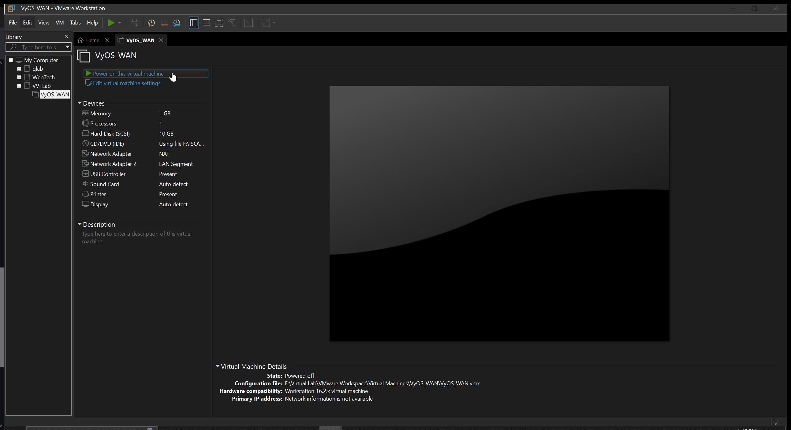
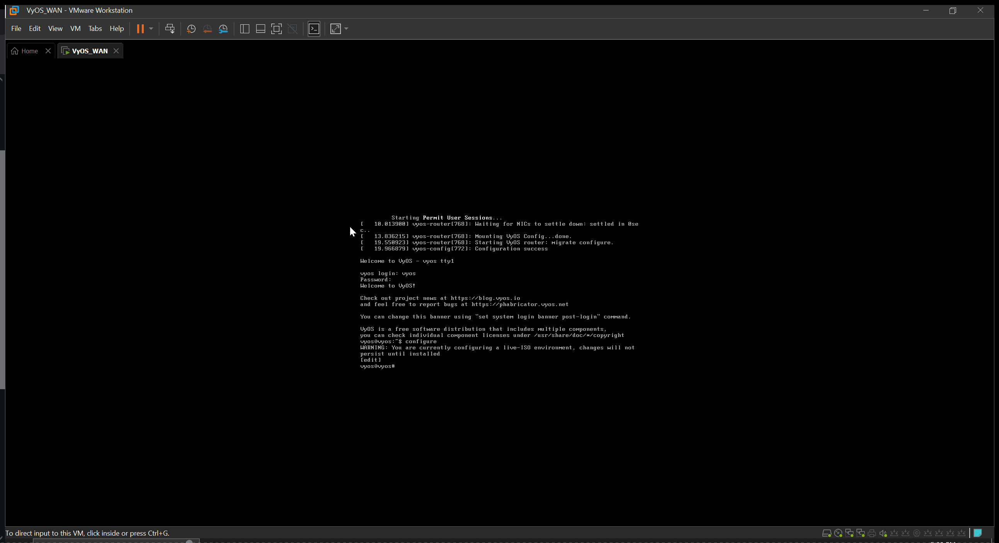
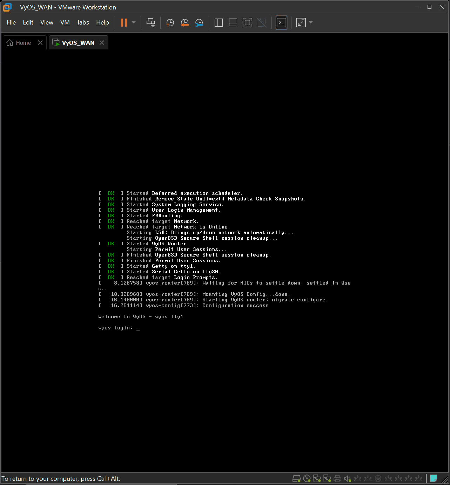
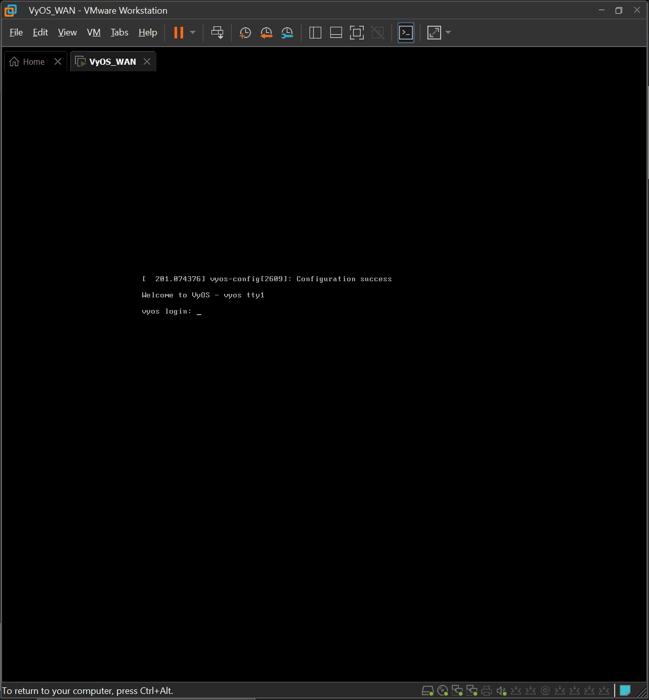

# Virtual Network: Virtual Router

## Under Review

## Overview: We are going to create and configure a basic Virtual Router
- [ ] Create a virtual router
- [ ] Install VyOS 1.4
- [ ] Configure network interfaces
- [ ] Configure DHCP/DNS
- [ ] Configure NAT
- [ ] Configure Firewall policies

## Create a Virtual Router: VyOS
  

### New Virtual Machine Wizard: will guide you through the process
- Select your ISO VMware needs to know your OS and its version. If unsure, refernce supporting documents.
-  Name your Virtual Machine, and Specify where it'll be saved.  
(User Preference)
- Select Disk Capacity. If your unsure how much space you need start with recommeneded settings. You can always add more storage to a VM. 
(User Preference) Store vs Split.
- Select Virtual Hardware based on your use case.
- This project will use Option 2. 

## VyOS Virtual Hardware: 

#### Option 1: Minimal specifications
- Processor: 1 virtual CPU
- Memory: 512 MB
- Storage: 4GB 

#### Option 2: Recommended specifications
- Processor: 1 virtual CPU
- Memory: 1 GB
- Storage: 10GB
- Network Adapter: NAT
- Network Adapter 2: LAN Segment (WAN)

### References:
- https://vyos.io/solutions/vyos-on-vmware

## Installing VyOS
  
- [ ] [User Guide](https://docs.vyos.io/en/latest/index.html)
- Default Credentials  
`User: vyos`  
`Password: vyos`  
- Run the command  
 `install image`
- Accept defualts 
- Reboot 

### VMware Snapshot (Recommended)
  
- Virtual SnapShots will help you save your progress
- SnapShots enable you to revert your VM
- More on this later

### Quick Start: For our use case we are going to utilize a basic configuration
  
- [ ] Use Command `config` to start
- [ ] [User Guide: Quick Start](https://docs.vyos.io/en/latest/quick-start.html)
- [ ] Alternative Resources: VyOS Cheat Sheet 
- https://github.com/bertvv/cheat-sheets/blob/master/docs/VyOS.md
- [ ] Interface Configuration  
`set interfaces ethernet eth0 address dhcp`  
`set interfaces ethernet eth0 description 'WAN'`  
`set interfaces ethernet eth1 address '172.31.1.1/24'` 
`set interfaces ethernet eth1 description 'LAN'`  
- [ ] DHCP/DNS  
`set service dhcp-server shared-network-name LAN subnet 172.31.1.0/24 default-router '172.31.1.1'`  
`set service dhcp-server shared-network-name LAN subnet 172.31.1.0/24 name-server '172.31.1.1'`  
`set service dhcp-server shared-network-name LAN subnet 172.31.1.0/24 domain-name 'vyos.net'`  
`set service dhcp-server shared-network-name LAN subnet 172.31.1.0/24 lease '86400'`  
`set service dhcp-server shared-network-name LAN subnet 172.31.1.0/24 range 0 start '172.31.1.9'`  
`set service dhcp-server shared-network-name LAN subnet 172.31.1.0/24 range 0 stop '172.31.1.50'`  
`set service dns forwarding cache-size '0'`  
`set service dns forwarding listen-address '172.31.1.1'`  
`set service dns forwarding allow-from '172.31.1.0/24'`  
- [ ] NAT  
`set nat source rule 100 outbound-interface 'eth0'`   
`set nat source rule 100 source address '172.31.1.0/24'`   
`set nat source rule 100 translation address masquerade`   
- [ ] Firewall  
`set firewall name OUTSIDE-IN default-action 'drop'`   
`set firewall name OUTSIDE-IN rule 10 action 'accept'`  
`set firewall name OUTSIDE-IN rule 10 state established 'enable'`  
`set firewall name OUTSIDE-IN rule 10 state related 'enable'`  
  `set firewall name OUTSIDE-LOCAL default-action 'drop'`  
`set firewall name OUTSIDE-LOCAL rule 10 action 'accept'`  
`set firewall name OUTSIDE-LOCAL rule 10 state established 'enable'`  
`set firewall name OUTSIDE-LOCAL rule 10 state related 'enable'`  
`set firewall name OUTSIDE-LOCAL rule 20 action 'accept'`  
`set firewall name OUTSIDE-LOCAL rule 20 icmp type-name 'echo-request'`  
`set firewall name OUTSIDE-LOCAL rule 20 protocol 'icmp'`  
`set firewall name OUTSIDE-LOCAL rule 20 state new 'enable'`  
  `set firewall interface eth0 in name 'OUTSIDE-IN'`  
`set firewall interface eth0 local name 'OUTSIDE-LOCAL'`  
- [ ] Hardening  
`set system login user myvyosuser authentication plaintext-password mysecurepassword`
- replace `myvyosuser` with your own user
- replace `mysecurepassword` with your own password
- Use command `show` to verify configuration
- Use command `commit` to apply changes
- Use command `save` to save configuration
# A Basic Virtual Router
  
## Test Your Configuration  
- [Prebuilt Virtual Machine-Kali](https://www.kali.org/get-kali/#kali-virtual-machines)
- Use the recommened VMware download
- Extract the Kali zip file in your Virtual WorkSpace File
- Try [7zip](https://www.7-zip.org/download.html), for extracting zip files
- change the network adpater to `LAN segment: WAN` 
- ping your router with command `ping 172.31.1.1`
- Its a good idea to test connectivity
### Basic Connectivity 🫠
  
## Troubleshooting steps
- [ ] Restart VM
- [ ] Verify VyOS configuration `show config`
- [ ] Verify VyOs interfaces `show interfaces`
- [ ] Verify network adapter on VMware
- [ ] Reference Documentation and Resources 

