# Virtual-Host P1: (Under Construction) 
>Note! Easy Install in VMware will use autologin (Not recommended)
## Overview
- Domain Joins
- Windows & Linux
## Windows Domain Prep & Join
- [ ] Create a Windows 10 VM
- LAN Segment `LOCAL LAN`
- Enable Device Passthrough in VM `.vmx` File  
`usb.generic.allowHID = "TRUE"`  
`usb.generic.allowLastHID = "TRUE"`  
- Make your Domain Controller your VM's DNS server
- [ ] Join Domain for Windows  
  
- Select `Settings` > `Accounts` > `Access work or school` > `Connect` > `Join this device to local Active Domain`
- Domain Name `CISO.net`  
If not found, verify your DNS configurations
- Domain Credentials  
Use an Administrative account to authorize the domain join  
## Rhel Installation 
- [ ] Create a Rhel VM
- LAN Segment `LOCAL LAN`
- Enable Device Passthrough in VM `.vmx` File  
`usb.generic.allowHID = "TRUE"`  
`usb.generic.allowLastHID = "TRUE"`  
- [ ] [Create a Red Hat Account](https://sso.redhat.com/auth/realms/redhat-external/login-actions/registration?client_id=https%3A%2F%2Fwww.redhat.com%2Fwapps%2Fugc-oidc&tab_id=x5ikI1GYHSs) (Required)
- [ ] [ISO Download](https://developers.redhat.com/products/rhel/download)
- [ ] Create a VM
- Connect to Red Hat  
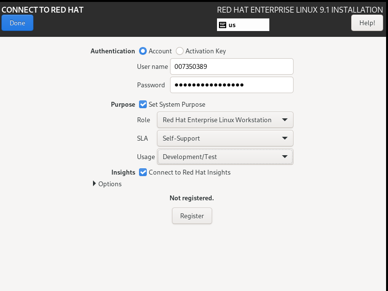  
- Software Selection  
> Note! I encourage you to play with the additional options  
- Basic Environment  
`Workstation`
- Additional Software   
`Smart Card Support`  
- Network & Host Name  
Hostname `RHEL9W` (Optional)  
Name the host anything you'd like  
Make your Domain Controller your VM's DNS server  
- Root Password  
`Y0uR$up3r$3cr3tP@ssW0rd!` 
For instructional Purposes Only I used a short insecure password
- Begin Installation
- [ ] Red Hat Registration Check  
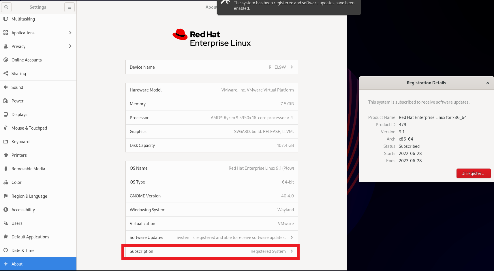  
- [ ] Verify your RHEL VM can update packages
- run the command `yum update`
- Reboot if Machine failes to update
- Verify Red Hat Subscription 
## Rhel Domain Prep  
> Note! By default Network Manager on RHEL dynamically update the resolv.conf, You can disable this  
- [ ] Our Rhel Workstation Needs to use our AD as a DNS Server  
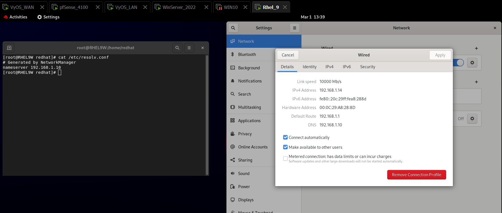  
- Method 1  
`nano /etc/resolv.conf`  
Add `nameserver 192.168.1.10`  
Go to Settings and Disable Automatc DNS  
- Method 2  
Select `Settings` > `Network` > Select the Gear Icon in `Wired`> `IPv4`  
Disable `Automatic` > In DNS specify your AD IP address  
- Method 3  
[Rhel Documentation](https://access.redhat.com/documentation/en-us/red_hat_enterprise_linux/8/html/configuring_and_managing_networking/manually-configuring-the-etc-resolv-conf-file_configuring-and-managing-networking#doc-wrapper)
- Verify Rhel can find your Domain  
Command `realm discover` `Name Of your Domain`  
Use Command `realm --help` for more info  
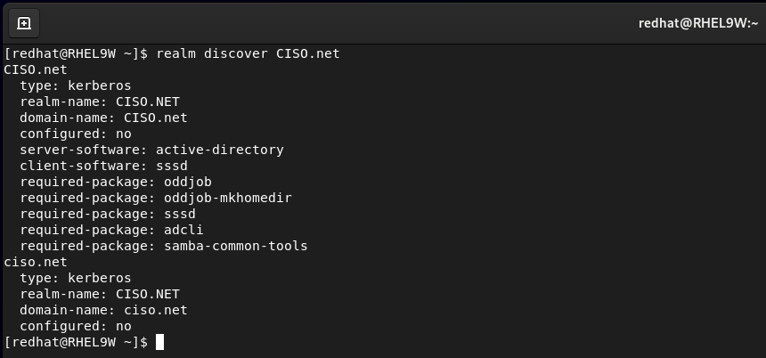  
- [ ] Install required Packages  
- Command `yum install sssd realmd oddjob oddjob-mkhomedir adcli samba-common samba-common-tools krb5-workstation openldap-clients policycoreutils-python-utils`
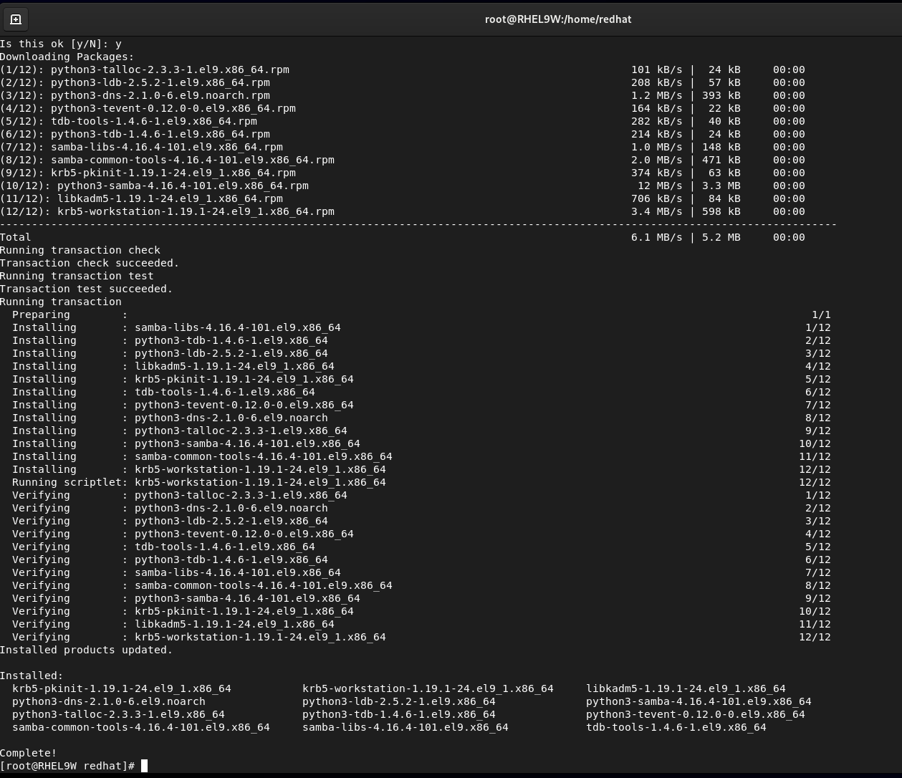  
## Rhel Domain Join  
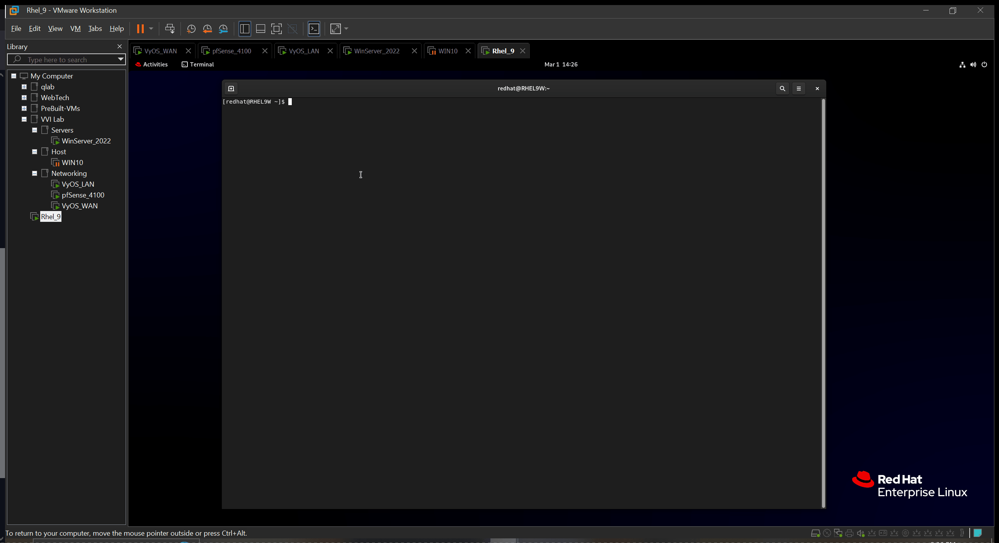  
- [ ] Verify Rhel can pull Domain User Credentials
- Command `id [username]@[domainame]`  
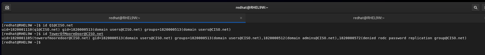  
- [ ] Verify Domain Users can Logon  
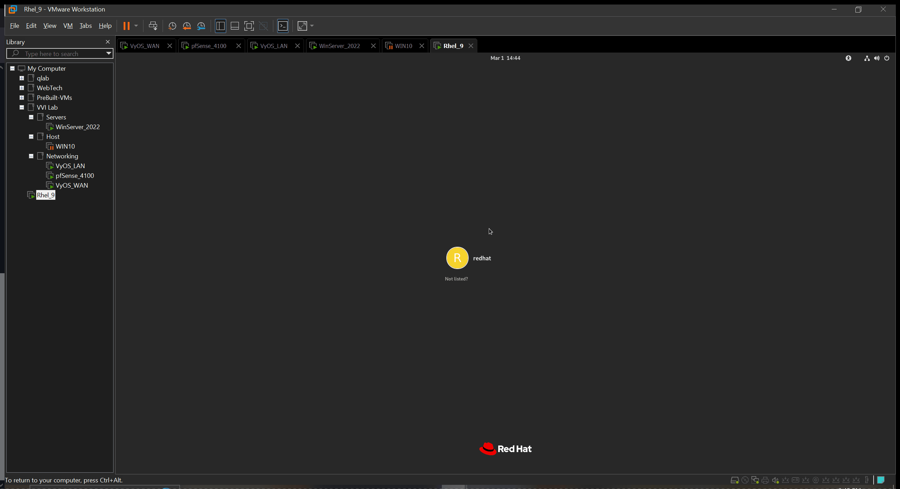  
- user `domain_username@your_domain_name.net`
- password `your_domain_user_password`
## Preferences (Highly Recommended)
- [ ] Easier Logins & Dynamic DNS
- Command `sudo nano /etc/sssd/sssd.conf`
- Add the following:  
`default_domain_suffix = YourDomainName`  
`ad_hostname = yourHostname.domainname`  
`dyndns_update = True`  
`dyndns_refresh_interval = 43200`  
`dyndns_update_prt = True`  
`dyndns_ttl = 3600`  
`dyndns_auth = GSS-TSIG`  
- You will need to use command `systemctl restart sssd` to ensure changes are applied
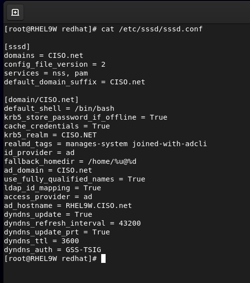  
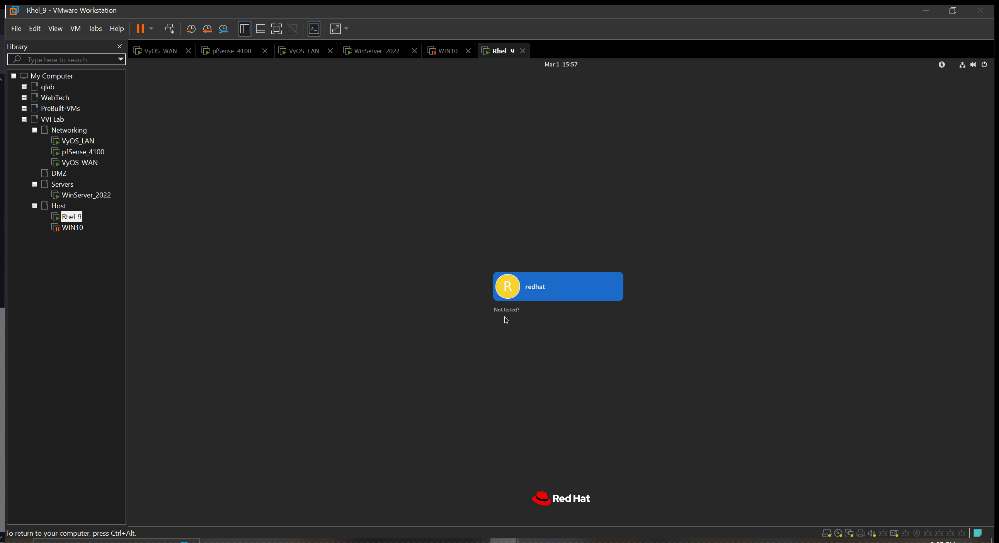  
### Whats the diffrence
- You make dont have to type `username@domain.com`, instead type just the `domain_username` 😌
- Check your Windows Sever DNS Manager, your Dynamic DNS updates are working. No maunal DNS record labor needed 💅🏾
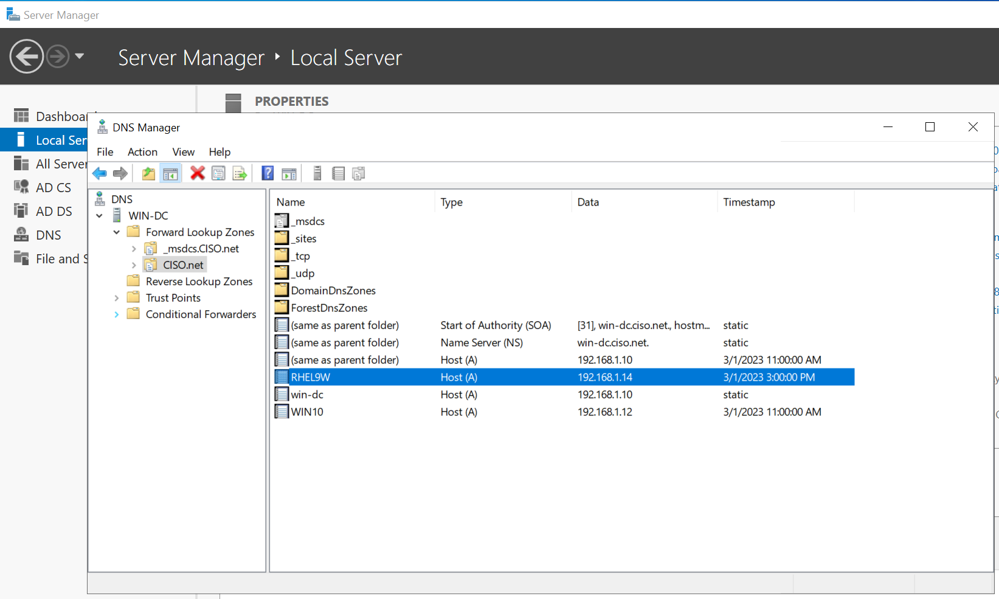

## References
- [ ] [Rhel Integration with Windows Active Directory ](https://access.redhat.com/documentation/en-us/red_hat_enterprise_linux/8/html/integrating_rhel_systems_directly_with_windows_active_directory/index)
- [ ] [Rhel Domain Join article](https://www.redhat.com/sysadmin/linux-active-directory)

## Challenge Create A Server VM & Join the Domain  
  
- Heres a hint: DNS is your best friend or worst enemey 
- [ ] Deploy a Rhel Server and Windows server in the DMZ network
- [ ] Join the Domain 
- [ ] Verify Domain User Authentication  
  
- Windows server Domain join is slightly different
## Discussion 
- Why join a Domain ?
