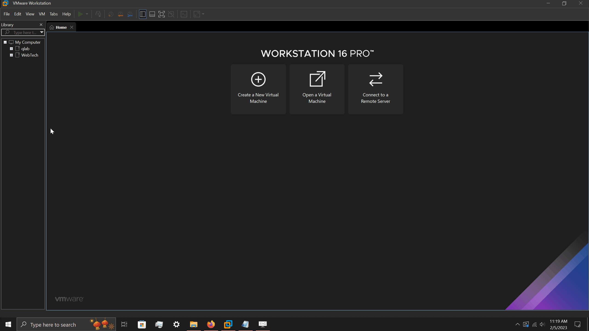
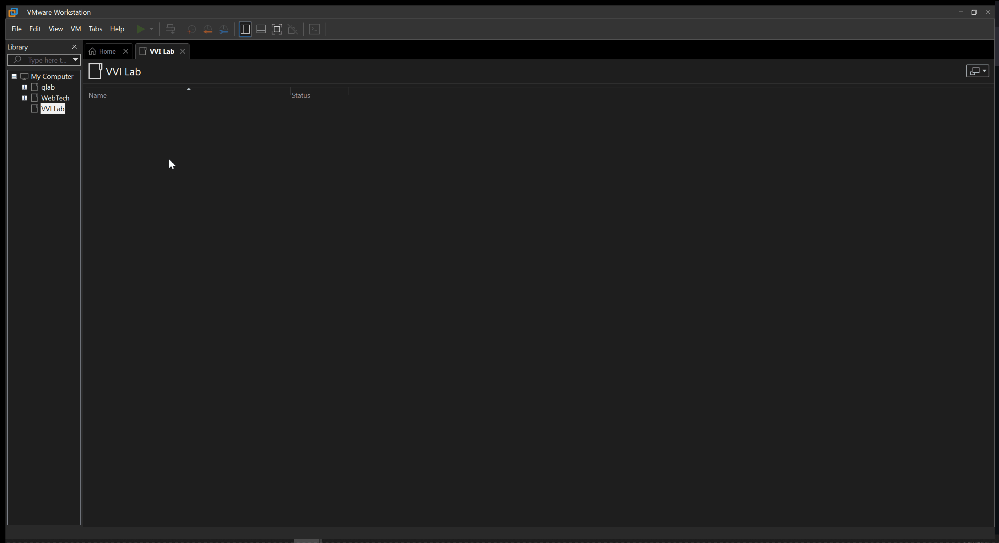

# Intro to VMware

## Get familiar with VMware Workstaion.

- [ ] Create a Folder for your virtual workspace on your pc, here is an example of what that could look like.  
### Lets stay organized 😊

## Virtual Network Editor
- [ ] This is where you can configure the Virutal Network adapters.

### Here is a simplified summary of VMware's virtual network adapters.

#### Bridge

- This will expose your VM to the Network your host machine is on. So just be careful.
- This project will **NOT** be using the Bridge network adapter

#### NAT
- The VM will have its own private network, with DHCP. However, be aware the VM will share your host IP address for internet access.
#### FUN FACT: NAT stands for Network Address Translation 🤓

#### Host-only
- This creates a private/isolated network within the host, with DHCP. Think of it as a private sandbox for your experiments. 🚀

#### Subnet IP
- [ ] Practice your Subnetting skills.
- The Virtual Network Editor allows your to specify your Network address and Subnet Mask

#### DHCP Settings...
- [ ] Curious on how IP addresses are assigned in your Virtual Lab? **Dynamic Host Configuration Protocol**🤖
- VMware Workstation by defaults sets you up for success. 
- Specify your IP ranges for your Virtual Machines. (Not nessary for the project) 
- Dont forget about the IP leases. This is how long a host's ip address are assigned. (Not nessary for the project)

### I encourage you to reference the Vmware's User Guide for more details.
- https://docs.vmware.com/en/VMware-Workstation-Pro/16.0/workstation-pro-16-user-guide.pdf

## Random Knowledge Check: The Difference between Network address & Host Address
- [ ] Given, Subnet IP 10.10.10.0 and Subnet Mask 255.255.255.0  
Can node A 10.10.11.23/24 ping node B IP 10.10.10.45/24 ?
- Why/Why not? 

#### HINT: An IP address has two components
1. Network Address: 
Identifies the Network 
2. Host Address: 
Identifies the Host

