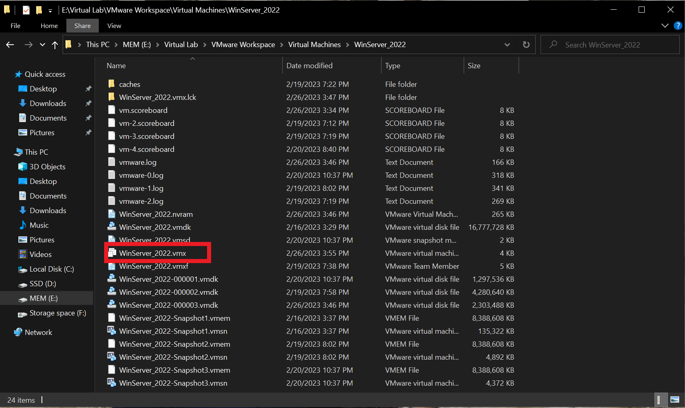
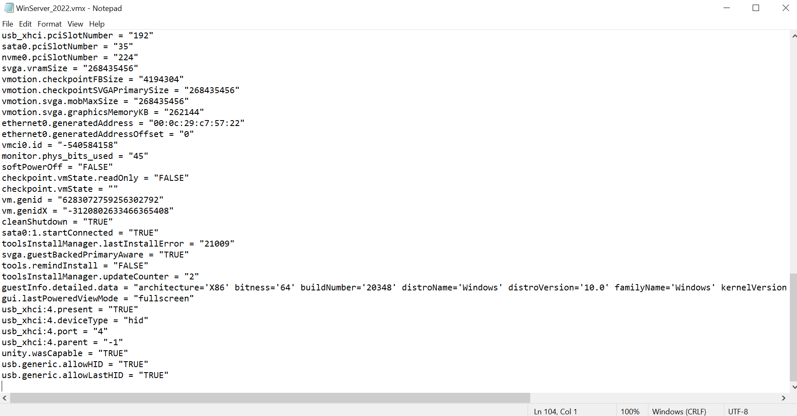
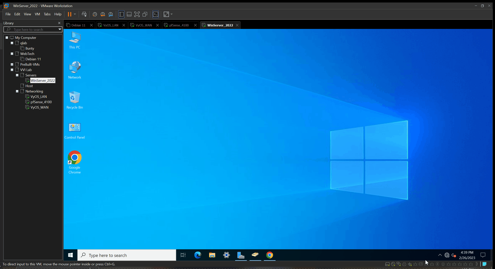
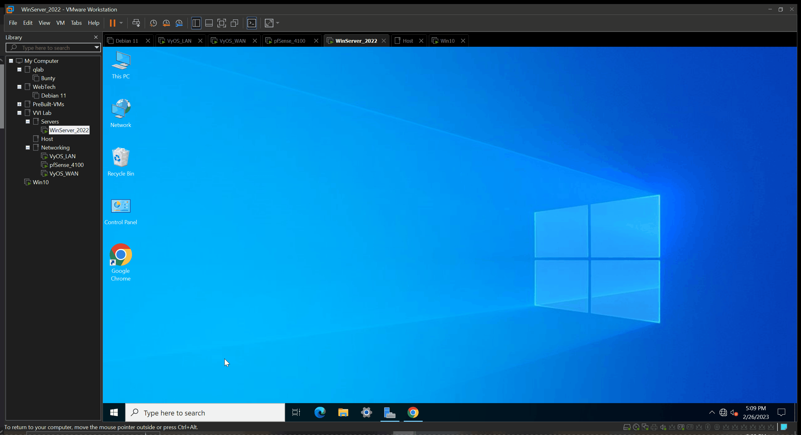
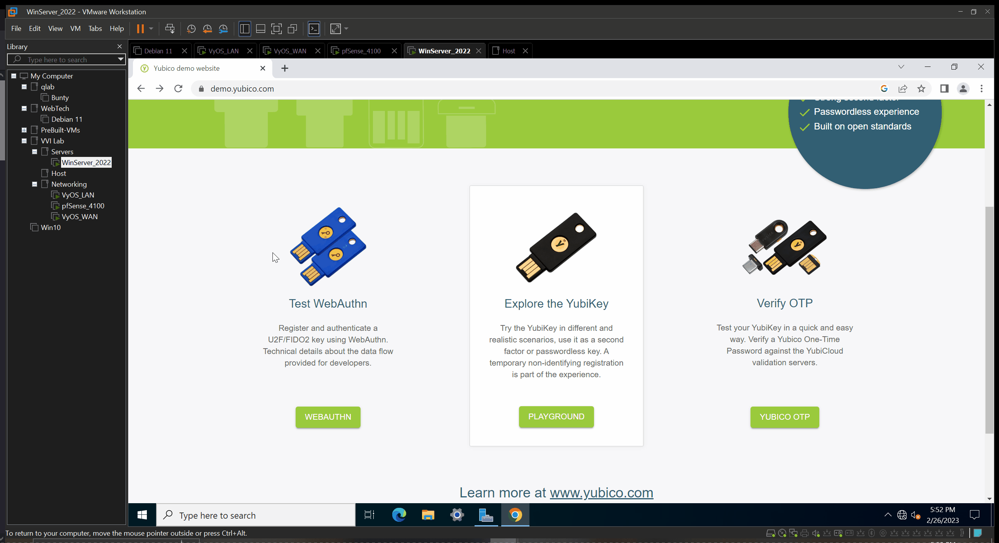

# Virtual-Server P2: Hardware Check (Under Construction)
## Overview
- Configure Device Passthough
- Installing Smart Card Drivers
- Testing Initial Config & Hardware

## Additional Hardware
- [ ] [Smart Card Reader](https://www.amazon.com/Identiv-SCR3310v2-0-Smart-Card-Reader/dp/B002N3MM6W/ref=sr_1_3?keywords=smart+card+reader&qid=1677462287&sprefix=smart+car%2Caps%2C182&sr=8-3)
- [ ] [PIV Smart Card](https://www.amazon.com/Taglio-Certificate-Authentication-Identification-Contactless/dp/B00SJV2CNK/ref=d_pb_allspark_dp_sims_pao_desktop_session_based_vft_med_sccl_3_2/130-9823239-2457105?pd_rd_w=lDNmz&content-id=amzn1.sym.6b5008ac-c24a-4aea-a3ea-015a531184f5&pf_rd_p=6b5008ac-c24a-4aea-a3ea-015a531184f5&pf_rd_r=ZN1Y9G74ES0PV9AQ6X11&pd_rd_wg=LXSF5&pd_rd_r=508a86fd-92f9-4e2c-9c3e-e156ae9c9c52&pd_rd_i=B00SJV2CNK&psc=1)
- [ ] [Yubikey 5 NFC](https://www.yubico.com/product/yubikey-5-nfc/)

## Updating the Virtual Machine's Configuration
  
- [ ] Device Passthrough with VMware Workstation
1. Shut down the virtual machine
2. Locate the VM's .vmx configuration file
3. Open the configuration file with a text editor
4. Add the two lines below to the file and save it  
`usb.generic.allowHID = "TRUE"`  
`usb.generic.allowLastHID = "TRUE"` 
  
### VMware Device Passthrough
  
- In VMware's bottom right corner you can select a device to passthrough/connect to your vm
- Your limited to one device at a time per VM
## Windows Server SmartCard Reader Driver Fix  
  
- [ ] `UMDF2` Microsoft Usbccid Smartcard Reader needs to replaced by `WUDF`
- Windows Server has a driver issue `UMDF2`
- Navigare to the `Device Manager` > `Smart Card Readers` > `Properties` > `Driver` > `Update Driver` > `Browse my computer for drivers` > ` Let me pick from a list of available drivers on my computer` 
- Select  `WUDF` > Next > Close

## Test Your Configuration
  
- [ ] [PIVKey Test](https://pivkey.com/starttest/)
- Using your VM test that your smart card and reader is working properly
- Note that you will have to physically insert your smart card.  

  
- [ ] [YubiKey Test](https://demo.yubico.com/webauthn-technical/registration)
- Note that you will have to physically touch your yubikey it will light up green
- [ ] [Yubikey Guides](https://support.yubico.com/hc/en-us/articles/360013707820-YubiKey-Smart-Card-Deployment-Guide)

## Additional Downloads for PIV SmartCard
- [ ] [PIVKey Admin Installer](https://pivkey.zendesk.com/hc/en-us/articles/203863995-PIVKey-Admin-Installer)
- I highly recommened your read the documentation and the `README.txt` for more details
- [Smart Card Documentation](https://pivkey.zendesk.com/hc/en-us)
- Select `PIVkey Installer-Admin-7.1.0.17.exe` (required)
- Select `vSEC_CMS_K2.0.exe` (optional)

