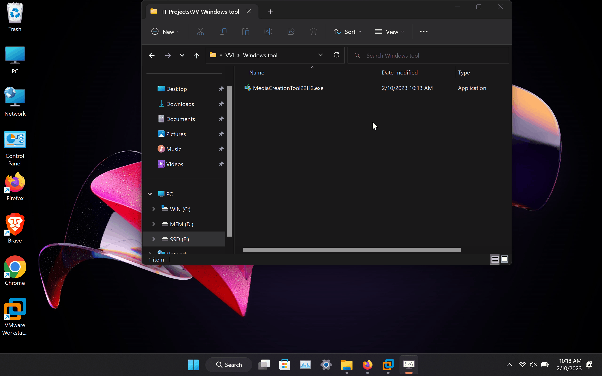

# Getting Started

> **Disclaimer** !!!   
The project is based off VMware Workstation on a windows environment.  
  Issues/Configuration on Linux, MacOS, VMware Fusion, Hyper-V, and VirtualBox have not be tested. (Planned for the Future)
  

## Download VMware

Try the 30 day trial

###  Windows
https://www.vmware.com/products/workstation-pro.html

### MacOS
https://www.vmware.com/products/fusion.html

### VMware alternative: VirtualBox
https://www.virtualbox.org/
- It free

## ISO
VyOS https://vyos.net/get/nightly-builds/  

PFsense https://www.pfsense.org/download/  

Windows 11 https://www.microsoft.com/software-download/windows11  

Windows 10 https://www.microsoft.com/en-us/software-download/windows10  
- [ ] Use Windows Media Creation Tool to get the ISO
- Create installation media (ISO file)
- Use the recommended  options
- ISO file
- Specify File location.
- Your Finished 👍 
 
  

Windows Server https://www.microsoft.com/en-us/evalcenter/evaluate-windows-server-2022  

RHEL 9
- [ ] Create Free user account  
https://www.redhat.com/wapps/ugc/register.html?_flowId=register-flow&_flowExecutionKey=e1s1  
- [ ] Download RHEL iso  

Ubuntu https://ubuntu.com/download/desktop  

Kali  
- [ ] Path 1: Installer Image https://www.kali.org/get-kali/#kali-installer-images  
- Requires configuration  
- [ ] Path 2: Prebuild Virtual Machine https://www.kali.org/get-kali/#kali-virtual-machines  
- Ready to Boot

## User Manual

https://docs.vmware.com/en/VMware-Workstation-Pro/16.0/workstation-pro-16-user-guide.pdf
