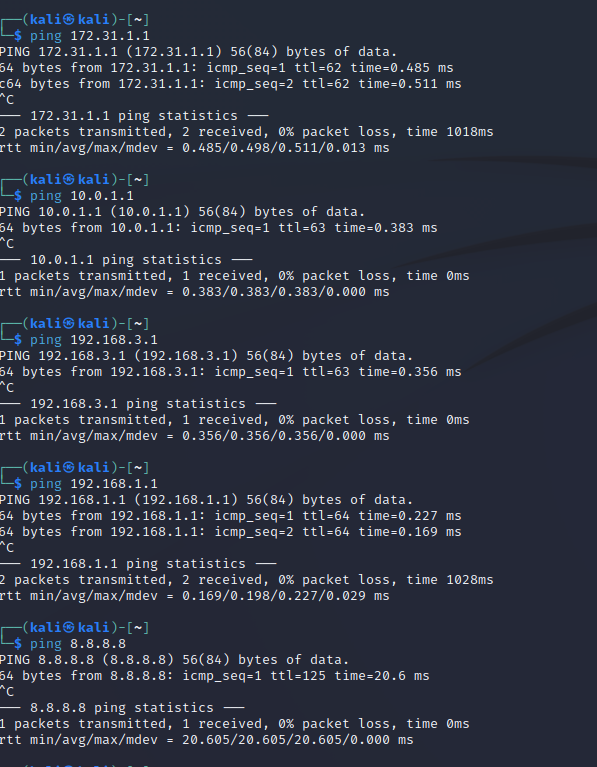
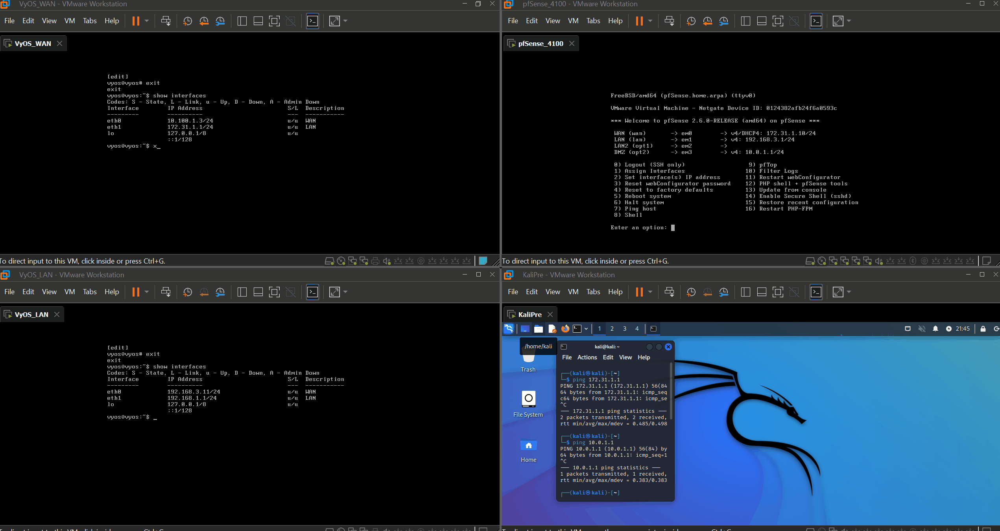

# Virtual Network: Virtual LAN Router 

- [ ] Apply what you've learned

## Required Changes
- [ ] Virutal Machine Hardware
- Network Adapter: LAN Segment (LAN1)
- Network Adapter 2: LAN Segment (LOCAL LAN)
- [ ] VyOS Configuration
- eth0 = DHCP
- eth1 = 192.168.1.1
#### Tip
- [ ] Use another VM to check LAN router's configured properly
  
### Good Luck
  
- [ ] We'll Go over any questions/issues during our alloted time
### References:
- [ ] https://vyos.io/solutions/vyos-on-vmware
- [ ] [User Guide](https://docs.vyos.io/en/latest/index.html)
- [ ] [User Guide: Quick Start](https://docs.vyos.io/en/latest/quick-start.html)
- [ ] Alternative Resources: VyOS Cheat Sheet 
- https://github.com/bertvv/cheat-sheets/blob/master/docs/VyOS.md

## Troubleshooting steps
- [ ] Restart VM
- [ ] Verify VyOS configuration `show config`
- [ ] Verify VyOs interfaces `show interfaces`
- [ ] Verify network adapter on VMware
- [ ] Reference Documentation and Resources 

