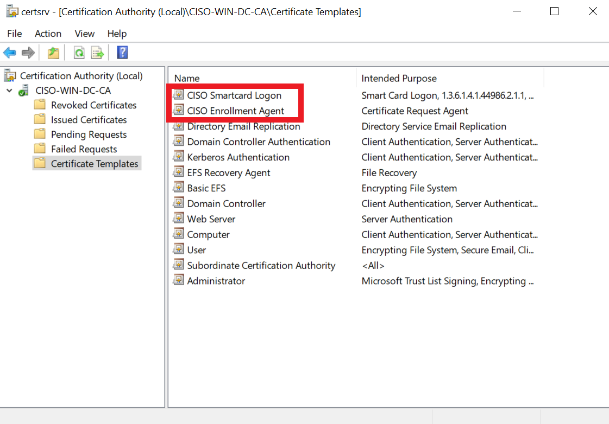
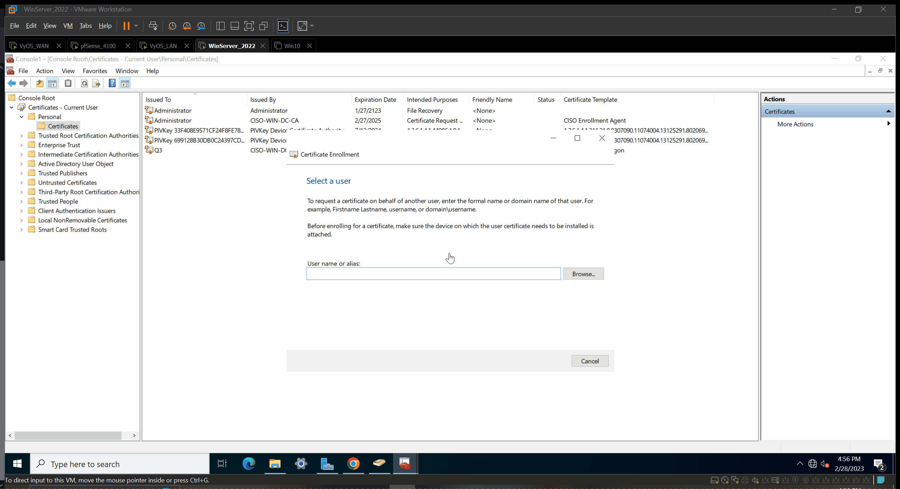
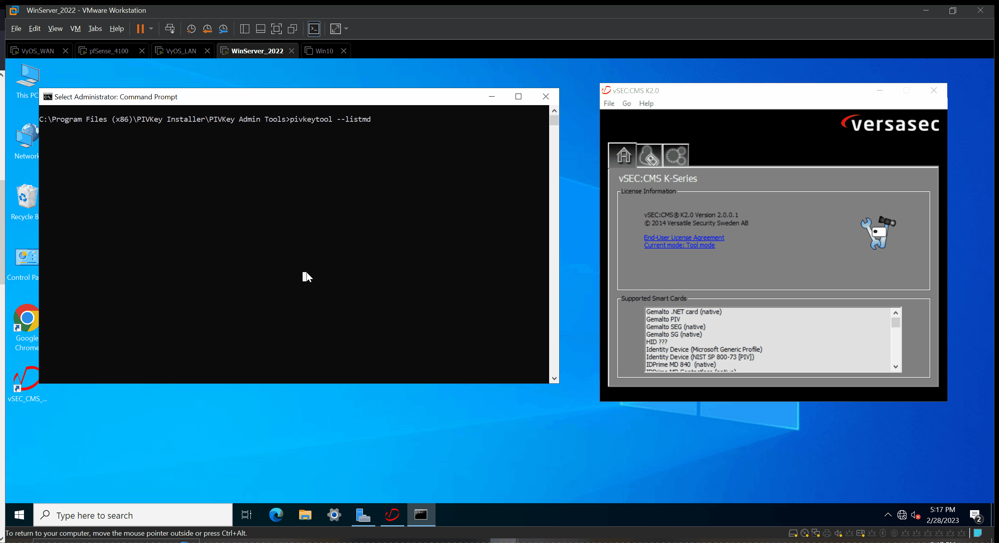

# Virtual-Server P3: (Under Construction)
## Overview
- Create Domain Users
- Creating a CA Enrollment Agent
- Creating Certificate Templates
- Configure Digitial Certificate
- Enrolling Certificates on behalf of another
- Configure Smart Card Users
## Create Domain Users
- [ ] Server Manager 
- Select `Tools` > `Active Directory Users and Computers`
- Select `Users` > Right Click `Users` > `New` > `User`
- Properties > Account > Check `Smart Card is required for interactive logon` (for smart card users)  
Make four user accounts for testing
## Windows Certificate Authority
- [ ] [Check List](https://pivkey.zendesk.com/hc/en-us/articles/203127999-Requirements-for-Issuing-Smart-Card-Certificates) 
## Enrollment Agent
- [ ] Server Manager
- Select `Certification Authority` > `CISO-WIN-DC-CA` > Right Click `Certificate Template`> `Manage` > `Enrollment Agent`> Duplicate Template
- [ ] Properties of New Template
- Compatibility:  
Certification Authority `Windows Server 2016`  
Certificate recipient `Windows 10 / Windows server 2016`  
- General:  
Template display name `CISO Enrollment Agent`  
Check `Publish certificate in Active Directory`
- Request Handling  
Check `Prompt the user during enrollment and require user input when the private key is used`
-  Cryptography  
Check `Microsoft Base Smart Card Crypto Provider`
- Security  
Specify Group or user  
Required Permissions `enroll`  
> NOTE! You may want to create an AD group specifically for the Enrollment Agents for security. For educational purposes only I'll use Domain Admins  
Click `Ok` and Close Window
- [ ] Certificate Template
- Right CLick > `New` > `Certificate Template to Issue` > `CISO Enrollment Agent`

## Mapping PIV Certificate using OID
- [ ] Certification Authority CISO-WIN-DC-CA
- Right Click `Certificate Template`> `Manage` > `Smart Card Logon`> Duplicate Template
- Repeat Compatibility
- General  
Template display name `CISO Smartcard Logon` 
Check `Publish certificate in Active Directory` 
- Request Handling  
Purpose `Signature and Smartcard Logon`  
Check `Prompt the user during enrollment and require user input when the private key is used`  
- Cryptography  
Check `Request must use one of the following providers` 
Proiders `Microsoft Base Smart Card Crypto Provider` 
- Issuance Requirements  
Check `This number of authrized aignatures` `1` 
Application Policy `Certificate Request Agent`
- Security  
Specify Group or user  
Required Permissions `enroll`  
Click `Ok` and Close Window  
- [ ] Certificate Template
- Right CLick > `New` > `Certificate Template to Issue` > `CISO Smartcard logon`
  
##  Issue your Enrollment Agent Certificate  
> Note! Use your Enrollment agent user  
- [ ] MMC.exe
- Select `File` > `Add Remove Snap-in` > `Certificates` > `My user account` > `Finish` > `Ok`
- Select `Certificates` > `Personal` > `Certificates` > Right Click `All Tasks` > `Request New Certifcate`
- Select `Next` > `Next` > Select `CISO Enrollment Agent` > `Ok` > `Finished`

## Enroll on Behalf of Others
> Note! Requires Enrollment Agent Certificate
- [ ] MMC.exe
- Select `Certificates` > `Personal` > `Certificates` > Right Click `All Tasks` > `Advanced Operations`> `Enroll on Behalf of`
- Select `Next` > `Next` > `Browse` > `OK` > `Next` > `CISO Smartcard Logon` > `Your Domain User` > `Enroll`
- Insert designated smart card & type pin 
- Wait a second 

## Testing our Configuration
  
- [ ] Check the PIV Keys Certificates  
### Challenge Join a Windows 10 VM to the Domain and login as a Domain User

## Group Policy Management
- [ ] Think of the GPO as rules and policies for the Computers and Users in your domain
- More on this later...
