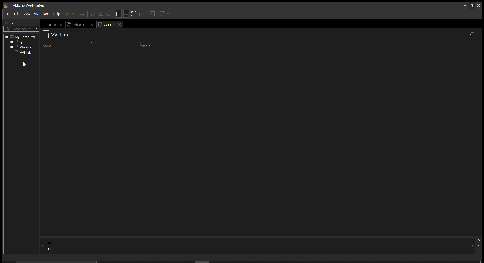

# Virtual Homelab Part 1: Virtual Router

## Under Construction

## Overview: We are going to create and configure a basic Virtual Router
- [ ] Create a virtual machine
- [ ] Install VyOS 1.4
- [ ] Configure a WAN interface
- [ ] Configure a LAN interface
- [ ] Configure DHCP/DNS
- [ ] Configure NAT
- [ ] Configure Firewall policies

## Create a Virtual Router: VyOS
  
### New Virtual Machine Wizard: will guide you through the process
- Select your ISO VMware needs to know your OS and its version. If unsure, refernce supporting documents.
-  Name your Virtual Machine, and Specify where it'll be saved.  
(User Preference)
- Select Disk Capacity. If your unsure how much space you need start with recommeneded settings. You can always add more storage to a VM. 
(User Preference) Store vs Split.
- Select Virtual Hardware based on your use case.
- This project will use Option 2. 

## VyOS Virtual Hardware: 

#### Option 1: Minimal specifications
- Processor: 1 virtual CPU
- Memory: 512 MB
- Storage: 4GB 

#### Option 2: Recommended specifications
- Processor: 1 virtual CPU
- Memory: 1 GB
- Storage: 10GB
- Network Adapter: NAT
- Network Adapter 2: LAN Segment (WAN)

#### Adding 

### References:
- https://vyos.io/solutions/vyos-on-vmware
## Installing VyOS

