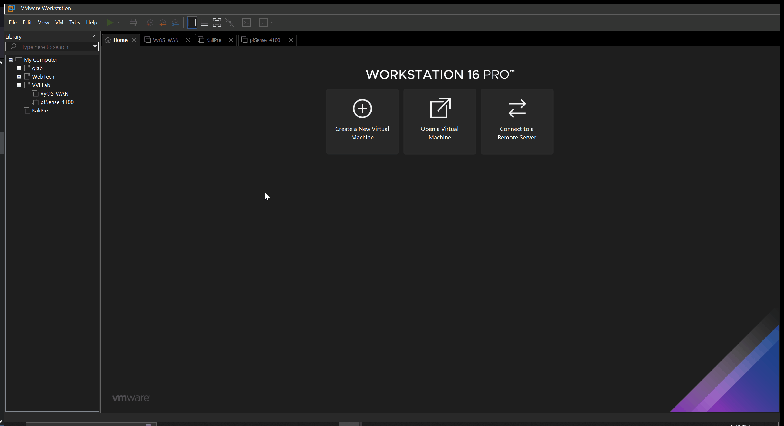
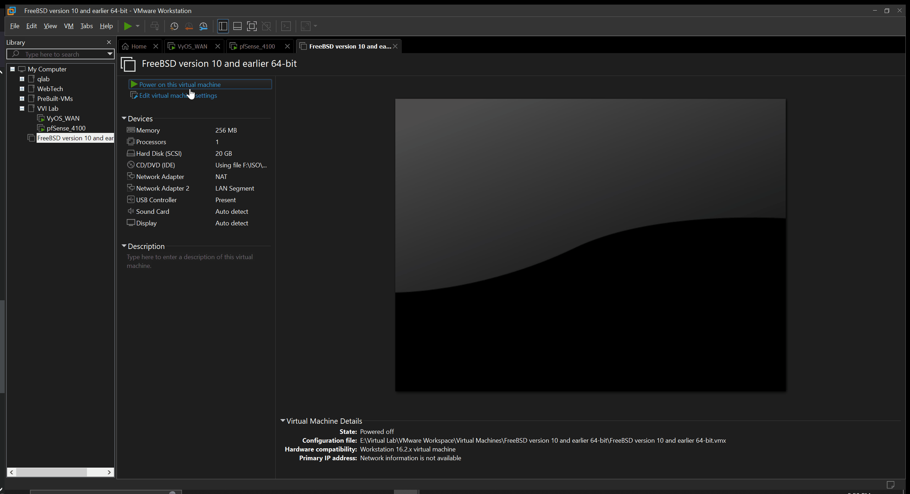
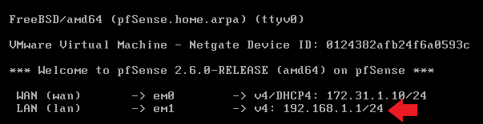

# Virtual Network: Firewall

## Under Review

## Overview: We are going to create and configure a Virtual Firewall
- [ ] Create a virtual Firewall
- [ ] Install pfSense Version 2.6.0
- [ ] Configure network interfaces
- [ ] Configure DHCP
- [ ] Configure NAT
- [ ] Configure Firewall policies
### Required Downloads & Documentation
- [ ] [pfSense v2.6](https://www.pfsense.org/download/)
- Architecture `AMD64 (64-bit)`
- Installer `DVD Image (ISO) Installer`
- Mirror `Austin, TX USA`
- [ ] [pfSense Documentation](https://docs.netgate.com/pfsense/en/latest/?_gl=1*2oi9it*_ga*MTkyNjgxODg3NC4xNjc2MjM4NDUz*_ga_TM99KBGXCB*MTY3NjIzODQ1Mi4xLjEuMTY3NjIzODg3OS4wLjAuMA..)
- [ ] [pfSense VMware Reference](https://docs.netgate.com/pfsense/en/latest/recipes/virtualize-esxi.html)

## Create a Virtual Firewall: PfSense
  

### New Virtual Machine Wizard: will guide you through the process

## pfSense Virtual Hardware: 
- [ ] [Netgate 4100](https://www.netgate.com/pfsense-plus-software/how-to-buy#appliances)
- We'll be referencing Netgate appliances for hardware specifications. 

#### Virtual specifications: 
- Processor: 1 virtual CPU, 2 virtual Cores
- Memory: 4 GB
- Storage: 128GB
- Network Adapter: LAN Segment (WAN)
- Network Adapter 2: LAN Segment (LAN1)
- Network Adapter 3: LAN Segment (LAN2)
- Network Adapter 4: LAN Segment (DMZ)

#### Low on Physical Resources
- Reduce number of cores per processor
- Use recommenended memory indicated by Virtual Machine Settings
- Reduce Hard Disk Size 

## Installing pfSense
  
- [ ] [Installation Walkthrough](https://docs.netgate.com/pfsense/en/latest/install/install-walkthrough.html)
- [ ] [pfSense Configuration Documentation](https://docs.netgate.com/pfsense/en/latest/config/index.html)
## pfSense webConfigurator
  
- We'll be using the pre built Kali VM to help us get started
- Remeber to change the Kali VM network adapter to LAN1
## Accessing pfSense webConfigurator
  
- pfSense by default is accessed on `192.168.1.1`
- A seperate VM needs to be on this network to access web GUI
### Initial Configuration
- [ ] [pfSense Setup Wizard](https://docs.netgate.com/pfsense/en/latest/config/setup-wizard.html)
- Default Credentials  
`User: admin`  
`Password: pfsense`  
- [ ] Changes
- LAN IP Address `192.168.3.1`
- Admin Password `Y0uRSuP3R$ecRetP@sSw0rd!`
### Verify Basic Connectivity
  
- Ping your devices
- Access the web

### VMware Snapshot (Recommended)

## Additional Configurations (Web GUI)
> Pending Updates  
- [ ] Enable Virtual Adapters
- Navigate to `Interfaces` > `Assignment`
- Select `+ Add` for `em2` and `em3`
- Save
> Note! Check out what VMware is doing with the network adapter using LAN Segment  
WAN = em0 LAN1 = em1 LAN2 = em2 DMZ = em3  
- [ ] Rename Interfaces
- Navigate to `Interfaces` > `OPT2`
- Select `Enable Interface`
- Description `DMZ` 
- IPv4 Configuration Type `Static IPv4`
- IPv4 Address `10.0.1.1` / `24`
- Save
- Apply Changes
-  [ ] enable DHCP
-  Navigate to `Services` > `DHCP Server`
-  Select `DMZ` and `Enable`
-  Save & Apply changes
- [ ] Initial Firewall Rule
-  Navigate to `Firewall` > `Rules` > `LAN`
-  Navigate to `Actions` Select Box icon `Copy` on second rule
-  Change Interface `DMZ` Source `DMZ net`
-  Save & Apply

## Note! Hardening is Required 
- More on this in another section
 

## Troubleshooting steps
- [ ] Restart VM
- [ ] Verify network adapter on VMware
- [ ] Verify Configuration
- [ ] Reference Documentation and Resources 
